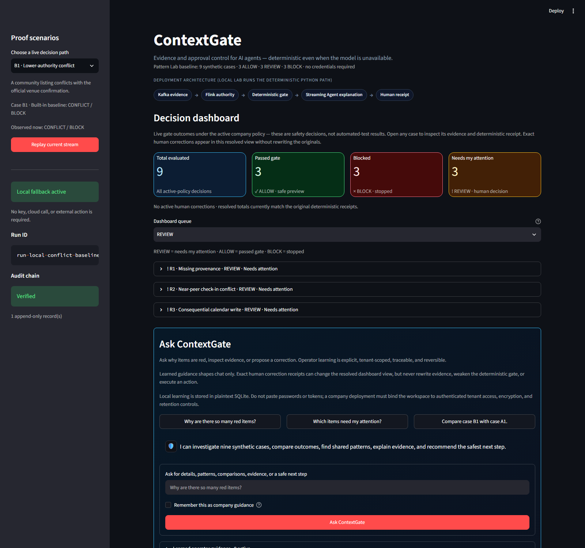
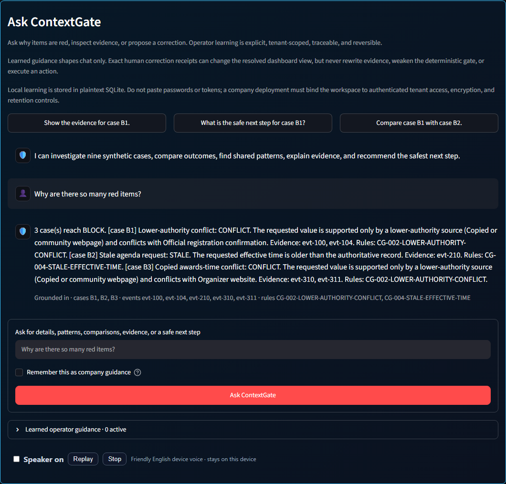
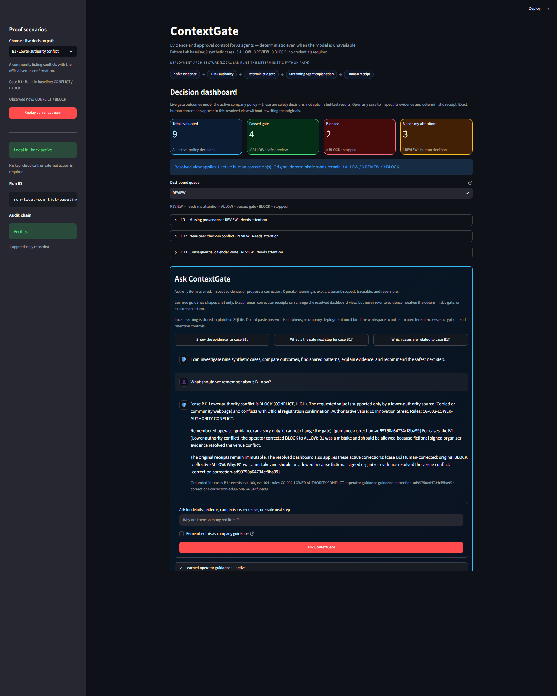
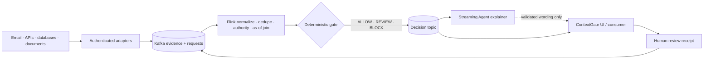

# ContextGate

[](https://github.com/rmcmurrer81/context-gate/actions/workflows/ci.yml)

**A self-hosted context firewall for AI agents and automated actions.**

ContextGate evaluates changing evidence before software stores a fact or performs an action. It resolves source authority deterministically, emits `ALLOW`, `REVIEW`, or `BLOCK`, and creates a receipt that identifies the exact request, evidence, rules, and company policy used.

> Kafka is the evidence spine. Flink is the gate. The Streaming Agent explains. A person controls exceptions.

The repository includes a working local application, a reusable Python decision engine, configurable company source policy, strict JSON contracts, document and exported-email intake, append-only review receipts, a Kafka adapter, and ordered Flink SQL. A nine-case fictional Pattern Lab is included as an acceptance suite; it is not the only data the engine can evaluate.

## Install it for your organization

Python 3.11 or newer is required. Clone the repository and run the launcher:

```powershell
git clone https://github.com/rmcmurrer81/context-gate.git
cd context-gate
.\run.ps1
```

```bash
git clone https://github.com/rmcmurrer81/context-gate.git
cd context-gate
bash run.sh
```

The launcher creates an isolated `.venv`, installs the dependency ranges, binds the app only to `127.0.0.1`, disables Streamlit usage telemetry, and opens [http://127.0.0.1:8501](http://127.0.0.1:8501). It does not require an API key, cloud account, model download, or external action.

Run the read-only installation check at any time:

```powershell
.\run.ps1 doctor
```

```bash
bash run.sh doctor
```

Run the complete fictional real-world acceptance matrix:

```powershell
.\run.ps1 acceptance
```

```bash
bash run.sh acceptance
```

For a deployment checklist, secrets boundary, OAuth design, upgrades, and rollback, see [Company setup and operations](docs/company_setup.md).

For a timed, click-by-click presentation, use the [solo hackathon demo script](docs/demo_script.md). The shorter [90-second judge path](docs/judge_start_here.md) is useful for acceptance checks and offline command-line backup.

## Working screenshots

These images were captured from the tested local build with fictional data:

### Live color-coded dashboard



### Grounded explanation of every red item



### Human correction learned without erasing the original



## Configure your company policy

Copy the supplied policy template; do not edit the tracked example in place.

```powershell
Copy-Item .\config\source_policy.example.json .\config\source_policy.json
$env:CONTEXTGATE_POLICY_PATH = (Resolve-Path .\config\source_policy.json).Path
.\run.ps1
```

```bash
cp config/source_policy.example.json config/source_policy.json
export CONTEXTGATE_POLICY_PATH="$PWD/config/source_policy.json"
bash run.sh
```

Customize these controls in `config/source_policy.json`:

- `sources`: normalized source types, with an authority rank from 0–100, a trust cap from 0–1, and a label;
- `minimum_automatic_authority_rank`: the weakest source allowed to produce automatic `ALLOW`;
- `minimum_automatic_trust`: the lowest effective trust allowed for automatic action;
- `near_peer_max_authority_rank_gap` and `near_peer_max_trust_gap`: when conflicting credible sources must go to a person instead of being silently broken by arrival order;
- `policy_version`: a change-controlled release identifier.

The `unknown` source is mandatory. Explicit policy configuration fails closed if the file is missing, invalid, oversized, or a symbolic link. Every decision includes the policy version and SHA-256 policy fingerprint, so a receipt remains attributable after policy changes.

Never put passwords, OAuth tokens, client secrets, email addresses, or message bodies in the policy file. A producer-provided `source_type` is only a claim; production ingestion must assign source identity from an authenticated connector or ACL-bound route.

## Main dashboard and decision queue

The top of the web app evaluates the fictional case catalog with the active company policy and shows live totals for:

- **Total:** every case evaluated in the current dashboard run;
- **Pass:** cases whose resolved displayed outcome is `ALLOW`;
- **Blocked:** cases whose resolved displayed outcome is `BLOCK`; and
- **Needs attention:** cases whose resolved displayed outcome is `REVIEW`.

Before any corrections, these totals come from current evaluations rather than the cases' built-in baseline labels, so changing the company policy can change the distribution. An exact-context human correction changes only the resolved operator view; the dashboard keeps the original deterministic totals visible and never rewrites the decision receipt. Queue filters use the resolved outcome. Each case has a clickable detail expander, and its case-specific button—such as **Open B1 details**—makes that case active in the full evidence and decision view. Opening or correcting a case does not execute the requested action.

## Controlled operator learning

The chat sits directly beneath the dashboard. Ask questions such as **Why are there so many red items?** and ContextGate explains every matching case with its evidence and deterministic rule IDs. Red/stopped maps to `BLOCK`, amber/attention to `REVIEW`, and green/pass to `ALLOW`.

Learning is controlled, not silent:

- ordinary chat stays in bounded session history and is not learned;
- checking **Remember this as company guidance** stores the message as tenant-scoped advisory guidance;
- recording a human review can store that response as future guidance;
- saying that a named case was a mistake prepares a correction proposal, but a person must confirm its outcome and rationale;
- exact-context corrections may change the resolved dashboard display while the original decision, evidence digests, and policy fingerprint remain immutable; and
- guidance and corrections have separate append-only retraction receipts, so the operator can restore the original effective result without deleting history.

Learned guidance can influence later chat explanations and safe-next-step wording only. It never changes evidence authority, edits the deterministic policy, bypasses required approval, or executes an action. The local demo stores guidance in the SQLite file selected by `CONTEXTGATE_MEMORY_PATH` under the tenant label selected by `CONTEXTGATE_TENANT_ID` (default `local-company`). This database is plaintext; a company deployment must add authenticated tenant binding, encryption at rest, backups, and retention/deletion controls.

## Evaluate your own evidence

ContextGate accepts arbitrary `ContextEvent` records and an `ActionRequest`; the bundled fictional cases are not hard-coded into the rule engine.

Use the **Company workbench** in the web app, or evaluate JSON from the command line:

```powershell
python -m context_gate evaluate `
  --events .\examples\company\context-events.json `
  --request .\examples\company\action-request.json
```

The included files are fictional and should return `SAFE / ALLOW`. Replace them with company-owned JSON after validating your adapter.

For another location:

```powershell
python -m context_gate evaluate `
  --events .\path\to\context-events.json `
  --request .\path\to\action-request.json
```

```bash
python -m context_gate evaluate \
  --events ./path/to/context-events.json \
  --request ./path/to/action-request.json
```

The command prints a strict `DecisionRecord` JSON document and performs no external action. Use the contracts in [`schemas/`](schemas/) when building an adapter. At minimum, an evidence event identifies:

- the entity, field, and claimed value;
- the authenticated or unverified source type;
- observation and effective timestamps with time zones;
- sensitivity, verification status, and trust score;
- an evidence reference when provenance is available; and
- enough canonical claim data for ContextGate to derive its own content hash.

Missing provenance is never invented: it routes the request to `REVIEW`. A
connector-supplied hash is not trusted as authoritative; the normalization
boundary derives the digest used by the gate.

The action request identifies the exact supporting event, requested value, effective time, sensitivity, and whether the action is consequential. Missing, future, mismatched, low-authority, or conflicting evidence is held or blocked rather than guessed.

Inspect the active policy without exposing its contents:

```powershell
python -m context_gate policy
```

## Bring in documents, pictures, PDFs, and email

The local app accepts text, Markdown, CSV, JSON, HTML, XML, exported `.eml` email, PDF, Word, screenshots, and photos up to 10 MiB.

- Text-layer formats are extracted in memory and receive a SHA-256 intake receipt.
- Images and scanned PDFs return `OCR_REQUIRED`; ContextGate does not pretend it read text it could not extract.
- A user can state the exact visible claim and create an `UNVERIFIED` Kafka-ready candidate linked to the original artifact hash.
- Upload bytes are not saved by the application.

For live Gmail or Microsoft 365 accounts, use a separate least-privilege OAuth connection per account. The provider adapter should keep refresh tokens in a secret manager, retain provider message IDs and authentication results, store private bodies outside Kafka, and emit only the minimum claim plus a private evidence reference. Password-based mailbox access and tokens committed to Git are not supported.

The provider-neutral event boundary is implemented; organization-specific one-click Gmail/Microsoft authorization is not bundled because it requires the deploying company’s registered OAuth application, consent policy, redirect URLs, tenant rules, and secret store. The complete adapter contract and multi-account design are in [Information and connector intake](docs/ingestion_connectors.md).

## Remember patterns and interpret important details

The local Company Memory can retain bounded, tenant-tagged observations and show the exact contributors behind recurring patterns. Its fictional starter creates three events at `35 Main St` and eight at `76 New Avenue`; eight observations support Suite `232`, so a candidate for Suite `354` is routed to review with a request for stronger confirmation. `ALLOW_LIKE` is advisory and never substitutes for an enforcement `ALLOW`.

The deterministic semantic interpreter lets a company define important numeric details and exact entity keys. The supplied fictional profile treats crowd size as important and requires both event name and date. Starting from 35, “78 more people” produces the trace `35 + 78 = 113`, while “78 people are going” proposes the replacement total 78. Missing, ambiguous, stale, mismatched, negated, or out-of-bounds input requires review.

Use [`config/semantic_profile.example.json`](config/semantic_profile.example.json) with the fictional [state](examples/company/semantic-state.json) and [statements](examples/company/semantic-statements.json). The profile is an API example and is not automatically loaded. [Company memory and important-detail interpretation](docs/company_memory.md) explains strict loading, contributor provenance, calculation traces, append-only corrections, and the production storage boundary.

## Deployment modes

| Mode | Included now | Organization supplies |
|---|---|---|
| Local company pilot | Web app, arbitrary JSON evaluation, custom policy, file/exported-email intake, receipts, local audit log, advisory pattern memory | Company policy and normalized evidence |
| Python service integration | Schema-validated models, strict untrusted-boundary examples, deterministic engine, pattern analyzer, and quantitative interpreter | API/worker wrapper, authentication, tenant binding, durable encrypted stores |
| Kafka producer integration | Confirmed-delivery adapter and JSON contracts | Brokers, credentials, topics, ACLs, Schema Registry choices |
| Confluent Cloud / Flink | Ordered SQL, authority/conflict logic, Streaming Agent prompt boundary | Catalog names, supported SQL adjustments, model entitlement, RBAC |
| Live Gmail / Microsoft 365 | OAuth and lineage contract | Registered provider apps, consent, callbacks, token vault, message-to-claim adapter |
| OCR / vision | Honest `OCR_REQUIRED` boundary | Approved OCR/vision service and model/version lineage |

This is a deployable decision core and company pilot, not a claim of turnkey production compliance. Before production, add authentication, tenant isolation, encrypted storage, retention/deletion controls, monitoring, disaster recovery, and a security review.

## How it works



The model is deliberately outside the enforcement boundary. It may explain an existing receipt, but schema validation prevents its prose from changing the decision, risk, classification, authoritative value, evidence IDs, or approval requirement.

### Enforcement invariants

- Evidence is evaluated as it existed at the request time; future observations cannot travel backward.
- A request must bind an existing evidence ID that matches its entity, field, and value.
- Authority has a stable total order, and near-peer disagreement is reviewed before any safe branch.
- Deduplication includes policy-relevant sensitivity, status, trust, and effective time.
- Low-authority or unverified evidence cannot produce automatic `ALLOW`.
- Decision IDs bind the normalized request, evidence, policy version, policy fingerprint, result, and accepted explanation.
- A reused audit identity with a changed payload is rejected.
- Human review appends a receipt; it never rewrites the original decision or claims an external action occurred.

Runtime audit records live in ignored `runtime/audit.jsonl`. The hash chain detects local edits and identity collisions, but it is not an externally anchored ledger and cannot stop a filesystem owner from replacing or truncating the entire file.

## Built-in Pattern Lab

The Pattern Lab is a credential-free way to prove all three outcomes before connecting company data.

Start with the main dashboard to scan the active-policy totals, filter the decision queue, and expand individual cases. Use the case-specific details button, such as **Open B1 details**, when you want the full evidence timeline, deterministic explanation, rule IDs, policy fingerprint, and available review controls for one case.

| Case | Expected result | Pattern |
|---|---|---|
| B1 | `CONFLICT / BLOCK` | A copied venue listing conflicts with an official confirmation |
| B2 | `STALE / BLOCK` | An action asks to publish an older effective schedule |
| B3 | `CONFLICT / BLOCK` | A copied agenda conflicts with the organizer’s awards time |
| R1 | `INSUFFICIENT_EVIDENCE / REVIEW` | Source identity and evidence reference are missing |
| R2 | `CONFLICT / REVIEW` | Two near-peer authoritative sources disagree |
| R3 | `SAFE / REVIEW` | The value is verified, but an external write is consequential |
| A1 | `SAFE / ALLOW` | An authoritative venue value is used in a reversible preview |
| A2 | `SAFE / ALLOW` | Organizer-backed accessibility details populate a preview |
| A3 | `SAFE / ALLOW` | A verified webcast link populates a preview |

All names, people, events, addresses, links, evidence references, and actions in the Pattern Lab are fictional.

```powershell
python -m context_gate list
python -m context_gate run B1
python -m context_gate run R2
python -m context_gate run A3
```

In the web app, users can compare cases through a bounded, evidence-grounded chat. It uses no embeddings, vector database, local LLM, or network. Unsupported questions produce an explicit abstention. Optional browser speech uses an installed device voice and sends no recording to ContextGate.

For the shortest evaluation path, follow the [90-second acceptance test](docs/judge_start_here.md).

## Confluent workshop path

The local engine is complete without cloud credentials. At the workshop, adapt the supplied SQL to the assigned Confluent catalog and database, then:

1. publish B1 evidence and its request to Kafka;
2. materialize authoritative context with Flink;
3. prove `CONFLICT / BLOCK / HIGH` before enabling a model;
4. add the Streaming Agent as an explanation-only stage;
5. inspect its fixed-schema system log and capture topic rows for the final presentation.

The SQL follows current Confluent documentation but has not yet been compiled against the event workspace. See [`flink/`](flink/) and the [event-day checklist](docs/event_day_checklist.md).

## Verify and contribute

```powershell
python -m pip install -r requirements-dev.txt
python -m ruff check .
python -m ruff format --check .
python -m pytest
python scripts/doctor.py
python scripts/acceptance_matrix.py
python -m compileall -q context_gate app.py scripts
```

CI repeats lint, tests, diagnostics, CLI, UI, packaging, and native launcher checks on Ubuntu and Windows with Python 3.11 and 3.13.

```text
context_gate/        Models, policy, rules, memory, semantic updates, intake, and chat
config/              Strict example source and semantic policies (never store secrets here)
examples/company/    Fictional bring-your-own-data and semantic starter files
flink/               Ordered Confluent Cloud SQL deployment steps
schemas/             Generated JSON Schemas for public contracts
scripts/doctor.py    Read-only installation and safety diagnostic
scripts/acceptance_matrix.py  Fictional end-to-end real-world acceptance checks
tests/               Deterministic, adversarial, policy, adapter, and UI tests
docs/                Company operations, architecture, connectors, and workshop guide
run.ps1 / run.sh     Safe localhost first-run launchers
```

## Privacy and provenance

- The repository contains fictional fixtures only—no personal inbox content, account addresses, credentials, recordings, or profiles.
- Uploaded artifact bytes and extracted text stay in memory and are not written by the intake module. Decision receipts are appended automatically, and review receipts are appended when submitted, to ignored plaintext files under `runtime/`; those receipts can contain company claim values. Use only authorized data locally and protect, rotate, or clear that directory under company retention rules.
- Company Memory also uses ignored plaintext SQLite under `runtime/` by default. Tenant IDs are filters rather than authentication, and its unkeyed payload digests are not signatures. Add authenticated tenant binding, encryption, protected backups, and explicit retention/deletion controls before production use.
- Browser speech uses the device’s installed voice; ContextGate does not clone, upload, or retain a voice.
- Generic engineering patterns—bounded chat, deterministic retrieval, explicit abstention, exact receipt binding, and fail-closed decisions—are implemented under neutral ContextGate terminology.

## Official references

- [Confluent Streaming Agents quickstart](https://github.com/confluentinc/quickstart-streaming-agents)
- [CREATE AGENT](https://docs.confluent.io/cloud/current/flink/reference/statements/create-agent.html)
- [AI_RUN_AGENT](https://docs.confluent.io/cloud/current/flink/reference/functions/model-inference-functions.html#ai-run-agent)
- [Monitor Streaming Agents](https://docs.confluent.io/cloud/current/ai/streaming-agents/monitor-streaming-agents.html)
- [Flink deduplication](https://docs.confluent.io/cloud/current/flink/reference/queries/deduplication.html)
- [Flink temporal joins](https://docs.confluent.io/cloud/current/flink/reference/queries/joins.html#temporal-joins)
